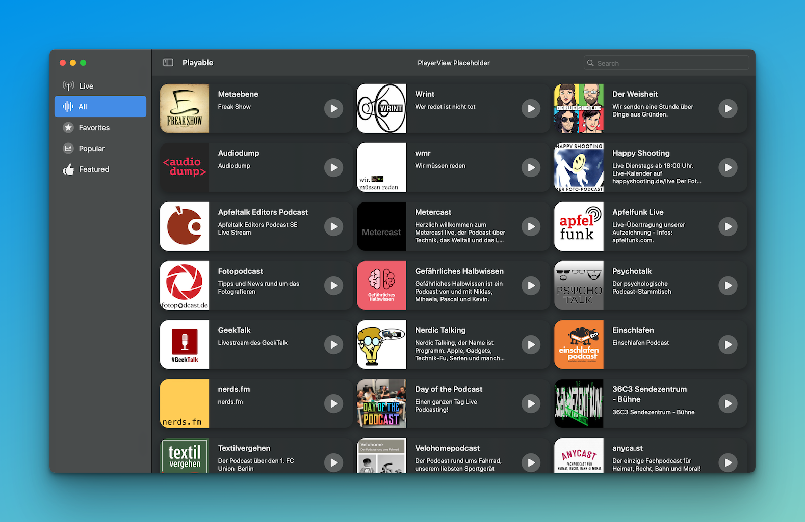

# Playable

Playable is a client for macOS to listen to live streaming podcasts. It currently supports all livestreams being broadcasted via [Ultraschall](http://ultraschall.fm) with [Studio Link On Air](https://studio-link.de).

The backend is a [Parse-Server](http://parseplatform.org) which is used to collect and control podcast meta data, manage push notifications and all marked favorites for each registered user.

So, here is an ongoing-by-progress changing screenshot. 😃

## Resources and Documentations
* [iTunes Search API 1](https://developer.apple.com/library/archive/documentation/AudioVideo/Conceptual/iTuneSearchAPI/index.html)
* [iTunes Search API 2](https://performance-partners.apple.com/search-api)
* [Taddy’s Podcast API](https://taddy.org/developers/podcast-api)
* [AUDD: MUSIC RECOGNITION API](https://www.audd.io)
* [Relax - REST Package](https://swiftpackageindex.com/tdeleon/relax/2.0.0/documentation/relax)

## Contact

* :envelope: [Write me an email](mailto:phranck@mac.com)
* :speech_balloon: [Ping us on Mastodon](https://chaos.social/@phranck)
* :memo: [Read our blog](https://podlive.io/blog)
